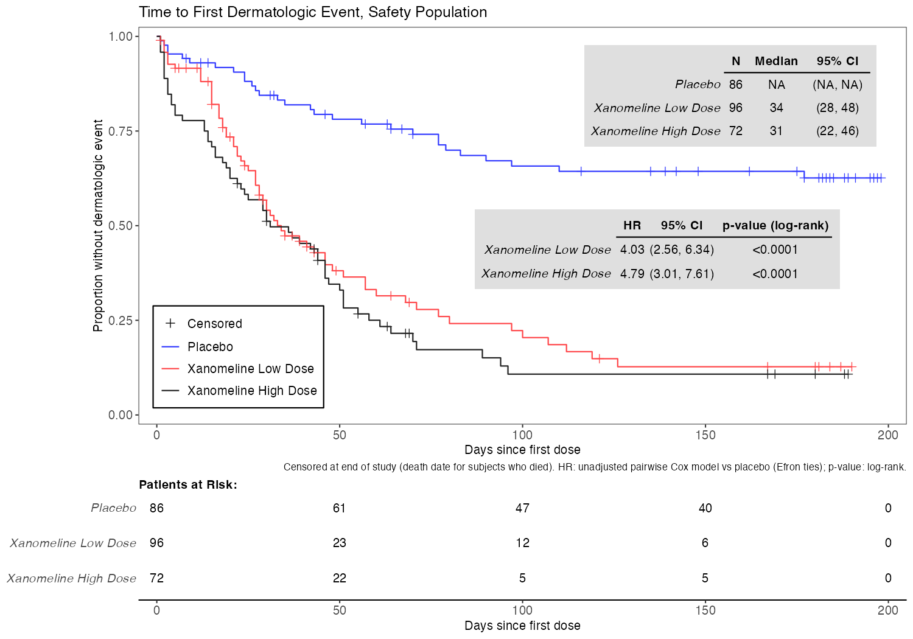

# ADTTE and survival analysis walkthrough

Time to first dermatologic event (PARAMCD `TTDE`) in the CDISC pilot, from ADAE through ADTTE to the Kaplan-Meier figure and the Cox model. Read it next to `adam/adae.R`, `adam/adtte.R`, `tlf/kmg01_ttde.R` and `tlf/coxt02_ttde.R`.

## Why this endpoint

The trial tested a xanomeline **transdermal patch** in Alzheimer's disease. Application-site skin reactions are the expected safety signal for a patch, so the time until a subject's first dermatologic event is a natural safety time-to-event endpoint. The definition here follows the CDISC pilot as re-implemented in R Consortium submissions pilot 3 (used as a specification; the code is written independently).

## Step 1: flag the events in ADAE

| Variable | Rule | This study |
|---|---|---|
| `CQ01NAM` | "DERMATOLOGIC EVENTS" if the preferred term contains APPLICATION, DERMATITIS, ERYTHEMA or BLISTER, **or** the SOC is skin and subcutaneous tissue disorders and the term is not cold sweat, hyperhidrosis or alopecia | 472 treatment-emergent records |
| `AOCC01FL` | Y on each subject's earliest treatment-emergent dermatologic record (by `ASTDT`, then `AESEQ`) | 151 subjects |

Cold sweat, hyperhidrosis and alopecia sit in the skin SOC but are not skin reactions to a patch. Written with explicit parentheses: in R, `&` binds tighter than `|`, so the exclusion applies only to the SOC clause.

## Step 2: build ADTTE

`admiral::derive_param_tte()` takes one row per subject from ADSL and picks an event if one exists, else a censoring date.

| Element | Rule |
|---|---|
| Population | safety population (`SAFFL = "Y"`), 254 subjects |
| Start (`STARTDT`) | `TRTSDT`, first dose |
| Event | `AOCC01FL = "Y"` in ADAE, date `ASTDT`, `CNSR = 0` |
| Censoring | end of study: the death date for subjects who died, else `EOSDT`, `CNSR = 1` |
| `AVAL` | `ADT - STARTDT + 1` days (first-dose day = day 1) |
| Traceability | `SRCDOM` / `SRCVAR` / `SRCSEQ` point to the record that set `ADT`; `EVNTDESC`, `CNSDTDSC` say why |

| Arm (actual) | N | Events | Censored |
|---|---|---|---|
| Placebo | 86 | 29 | 57 |
| Xanomeline Low Dose | 96 | 63 | 33 |
| Xanomeline High Dose | 72 | 59 | 13 |

**QC.** No pharmaverseadam reference exists for this endpoint, so `R/qc_adtte.R` derives TTDE a second time in plain dplyr from the specification, without admiral: its own dermatologic query, its own first-event selection, its own censoring rule. The two builds are identical on `STARTDT`, `ADT`, `AVAL`, `CNSR` and `EVNTDESC` for all 254 subjects. A test also checks that no event is dated after the subject's end of study.

## Step 3: Kaplan-Meier (KMG01)



- **Reading it.** Each curve is the estimated proportion of subjects still free of a dermatologic event over time. Both xanomeline curves drop fast in the first 50 days; placebo levels off above 60%.
- **Median time to first event:** 34 days (low dose), 31 days (high dose). Placebo has no median: its curve never falls below 50%, which is why the table shows NA.
- **Hazard ratios in the figure** are unadjusted pairwise Cox models against placebo (4.03 and 4.79), with log-rank p-values. They differ from the table below because the table adjusts for age and sex.
- **Patients at risk** under the plot: the dosed arms thin out quickly (12 and 5 left at day 100), so the right-hand tails rest on few subjects.

## Step 4: Cox model (COXT02)

```
Effect/Covariate Included in the Model   Hazard Ratio      95% CI      p-value
Treatment:
  TRTA (reference = Placebo)                                           <0.0001
    Xanomeline Low Dose                      4.28       (2.72, 6.74)   <0.0001
    Xanomeline High Dose                     4.97       (3.15, 7.87)   <0.0001
Covariate:
  Age                                        0.99       (0.97, 1.00)   0.1413
  SEX (reference = F), M                     1.41       (1.02, 1.94)   0.0394
```

- **Model:** `Surv(AVAL, EVENT) ~ TRTA + AGE + SEX`, Efron ties, Wald p-values.
- **Interpretation:** at any point in time, a subject on high-dose xanomeline has about five times the instantaneous rate of a first dermatologic event of a comparable placebo subject (same age and sex). The confidence intervals are far from 1.
- **Why COXT02 and not COXT01.** The catalog's univariate layout (COXT01) accepts only two arms; this study has three. The multivariable layout fits all three arms in one model.
- **QC.** A test refits the model with `survival::coxph()` and checks the hazard ratios and confidence intervals in the table to 1e-8.

## Step 5: proportional-hazards check

The Cox model assumes each hazard ratio is constant over time. `survival::cox.zph()` tests that with scaled Schoenfeld residuals:

| Term | p |
|---|---|
| TRTA | 0.39 |
| AGE | 0.48 |
| SEX | 0.65 |
| Global | 0.68 |

No term rejects the assumption, so a single hazard ratio per arm is a fair summary. A test fails the build if the global p drops below 0.05.

## Findings and judgment calls

1. **Ties default.** `tern::summarize_coxreg()` defaults to `ties = "exact"`; `survival::coxph()` and the KM annotation default to Efron. Left at defaults, the table and the figure would use different methods. Both are now set to Efron explicitly, and the footnotes say so.
2. **Censoring may be informative.** Of the censored subjects in the dosed arms, 23 discontinued for an adverse event (17 low dose, 6 high dose). If some of those discontinuations were driven by skin problems not yet coded as a dermatologic event, censoring them understates the event rate. A sensitivity analysis would treat discontinuation for an adverse event as an event, or as a competing risk.
3. **Actual vs planned arm.** The analysis uses actual treatment (`TRTA`), the usual choice for safety. The 12 subjects planned for high dose who received low dose count in the low-dose arm here.

## Exercises

1. Add the sensitivity analysis from finding 2: a second parameter `TTDEAE` in ADTTE where discontinuation for an adverse event counts as an event. Compare the hazard ratios.
2. Add a stratified log-rank test (by `AGEGR1`) and check whether it changes the conclusion.
3. Reproduce the figure with `ggsurvfit` and check the at-risk numbers match.
